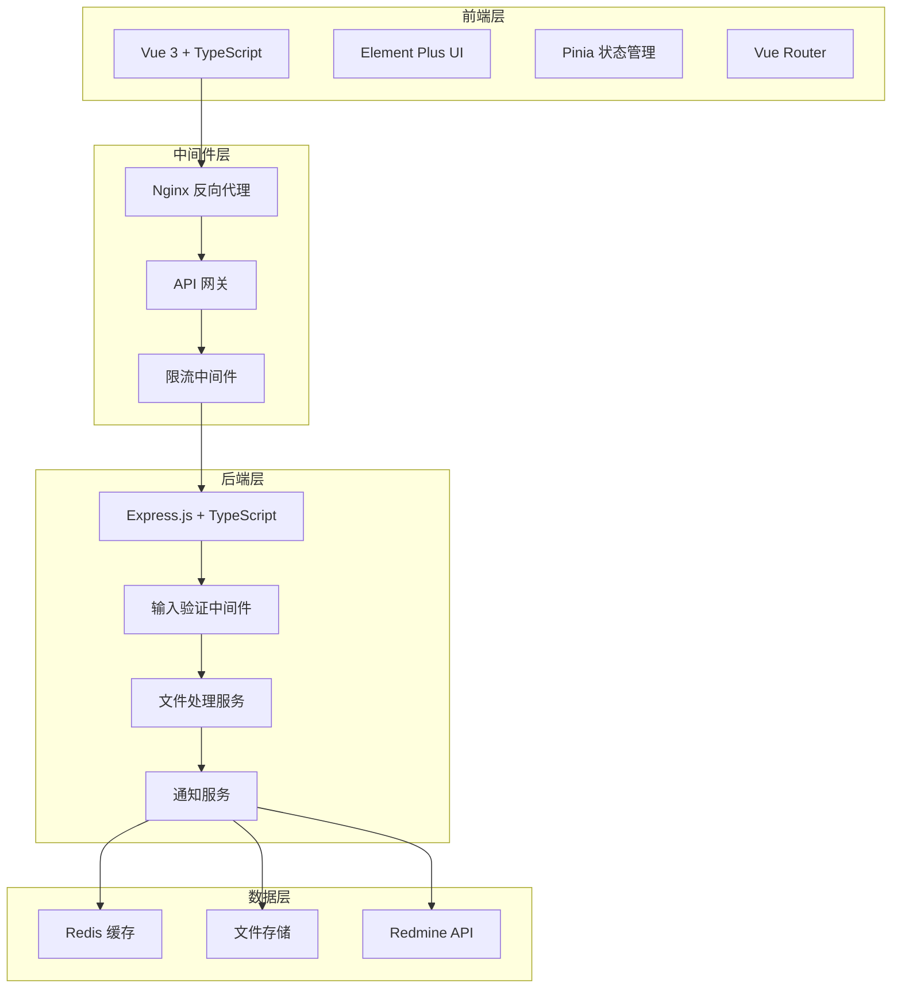

# 项目优化设计文档

## 概述

本设计文档详细描述了 HSReporter 问题反馈系统的优化方案，涵盖前端、后端、架构、性能、安全性和开发流程等各个方面的改进。

## 架构设计

### 整体架构优化



### 技术栈升级

**前端技术栈:**
- Vue 3 + Composition API (已有)
- TypeScript (新增)
- Pinia 状态管理 (新增)
- Element Plus (已有)
- Vite (已有，优化配置)
- Vitest 单元测试 (新增)

**后端技术栈:**
- Express.js + TypeScript (升级)
- Joi/Zod 数据验证 (新增)
- Winston 日志系统 (新增)
- Redis 缓存 (新增)
- Helmet 安全中间件 (新增)
- Rate limiting (新增)

## 组件和接口设计

### 前端组件架构

```
src/
├── components/           # 通用组件
│   ├── common/          # 基础组件
│   │   ├── BaseButton.vue
│   │   ├── BaseInput.vue
│   │   ├── BaseUpload.vue
│   │   └── LoadingSpinner.vue
│   ├── form/            # 表单组件
│   │   ├── FeedbackForm.vue
│   │   ├── BugForm.vue
│   │   ├── ComplaintForm.vue
│   │   └── SuggestionForm.vue
│   └── layout/          # 布局组件
│       ├── AppHeader.vue
│       ├── AppFooter.vue
│       └── AppLayout.vue
├── composables/         # 组合式函数
│   ├── useForm.ts
│   ├── useUpload.ts
│   ├── useCaptcha.ts
│   └── useNotification.ts
├── stores/              # Pinia 状态管理
│   ├── feedback.ts
│   ├── user.ts
│   └── app.ts
├── services/            # API 服务
│   ├── api.ts
│   ├── feedback.ts
│   └── upload.ts
├── types/               # TypeScript 类型定义
│   ├── feedback.ts
│   ├── api.ts
│   └── common.ts
└── utils/               # 工具函数
    ├── validation.ts
    ├── format.ts
    └── constants.ts
```

### 后端 API 架构

```
src/
├── controllers/         # 控制器
│   ├── feedbackController.ts
│   ├── captchaController.ts
│   └── uploadController.ts
├── middleware/          # 中间件
│   ├── validation.ts
│   ├── auth.ts
│   ├── rateLimit.ts
│   ├── errorHandler.ts
│   └── logger.ts
├── services/            # 业务逻辑服务
│   ├── feedbackService.ts
│   ├── redmineService.ts
│   ├── uploadService.ts
│   └── notificationService.ts
├── models/              # 数据模型
│   ├── Feedback.ts
│   ├── Upload.ts
│   └── User.ts
├── utils/               # 工具函数
│   ├── validation.ts
│   ├── encryption.ts
│   ├── fileHandler.ts
│   └── logger.ts
├── config/              # 配置文件
│   ├── database.ts
│   ├── redis.ts
│   └── app.ts
└── types/               # TypeScript 类型
    ├── api.ts
    ├── feedback.ts
    └── common.ts
```

### API 接口设计

**RESTful API 端点:**

```typescript
// 反馈相关
POST   /api/v1/feedback           // 提交反馈
GET    /api/v1/feedback/:id       // 查询反馈状态
GET    /api/v1/feedback/stats     // 获取统计信息

// 文件上传
POST   /api/v1/upload             // 上传文件
DELETE /api/v1/upload/:id         // 删除文件

// 验证码
GET    /api/v1/captcha/generate   // 生成验证码
POST   /api/v1/captcha/verify     // 验证验证码

// 系统
GET    /api/v1/health             // 健康检查
GET    /api/v1/version            // 版本信息
```

**统一响应格式:**

```typescript
interface ApiResponse<T = any> {
  success: boolean;
  data?: T;
  message?: string;
  error?: {
    code: string;
    details?: any;
  };
  timestamp: string;
  requestId: string;
}
```

## 数据模型设计

### 反馈数据模型

```typescript
interface FeedbackData {
  id: string;
  type: 'bug' | 'complaint' | 'suggestion';
  title: string;
  description: string;
  priority: 'low' | 'medium' | 'high' | 'urgent';
  status: 'submitted' | 'processing' | 'resolved' | 'closed';
  contact: {
    email?: string;
    phone?: string;
    hsId?: string;
  };
  attachments: FileAttachment[];
  metadata: {
    userAgent: string;
    ip: string;
    timestamp: Date;
    source: string;
  };
  redmine: {
    issueId?: number;
    status?: string;
    assignee?: string;
  };
}

interface FileAttachment {
  id: string;
  filename: string;
  originalName: string;
  mimetype: string;
  size: number;
  path: string;
  uploadedAt: Date;
  redmineToken?: string;
}
```

## 错误处理设计

### 前端错误处理

```typescript
// 全局错误处理
class ErrorHandler {
  static handle(error: Error, context?: string) {
    // 记录错误
    console.error(`[${context}]`, error);
    
    // 用户友好的错误提示
    const userMessage = this.getUserMessage(error);
    ElMessage.error(userMessage);
    
    // 发送错误报告（可选）
    this.reportError(error, context);
  }
  
  private static getUserMessage(error: Error): string {
    if (error.name === 'ValidationError') {
      return '输入信息有误，请检查后重试';
    }
    if (error.name === 'NetworkError') {
      return '网络连接异常，请稍后重试';
    }
    return '操作失败，请稍后重试';
  }
}
```

### 后端错误处理

```typescript
// 统一错误处理中间件
export const errorHandler = (
  err: Error,
  req: Request,
  res: Response,
  next: NextFunction
) => {
  const requestId = req.headers['x-request-id'] as string;
  
  // 记录错误日志
  logger.error('API Error', {
    error: err.message,
    stack: err.stack,
    requestId,
    url: req.url,
    method: req.method,
    body: req.body,
    query: req.query
  });
  
  // 返回统一错误响应
  const response: ApiResponse = {
    success: false,
    message: getErrorMessage(err),
    error: {
      code: getErrorCode(err),
      details: process.env.NODE_ENV === 'development' ? err.stack : undefined
    },
    timestamp: new Date().toISOString(),
    requestId
  };
  
  res.status(getStatusCode(err)).json(response);
};
```

## 测试策略

### 前端测试

```typescript
// 组件测试示例
describe('FeedbackForm', () => {
  it('should validate required fields', async () => {
    const wrapper = mount(FeedbackForm);
    
    await wrapper.find('[data-test="submit-btn"]').trigger('click');
    
    expect(wrapper.find('[data-test="description-error"]').exists()).toBe(true);
    expect(wrapper.find('[data-test="captcha-error"]').exists()).toBe(true);
  });
  
  it('should submit form with valid data', async () => {
    const mockSubmit = vi.fn();
    const wrapper = mount(FeedbackForm, {
      props: { onSubmit: mockSubmit }
    });
    
    await wrapper.find('[data-test="description"]').setValue('Test description');
    await wrapper.find('[data-test="captcha"]').setValue('1234');
    await wrapper.find('[data-test="submit-btn"]').trigger('click');
    
    expect(mockSubmit).toHaveBeenCalledWith({
      description: 'Test description',
      captcha: '1234'
    });
  });
});
```

### 后端测试

```typescript
// API 测试示例
describe('POST /api/v1/feedback', () => {
  it('should create feedback successfully', async () => {
    const feedbackData = {
      type: 'bug',
      description: 'Test bug report',
      contact: { email: 'test@example.com' },
      captcha: '1234',
      captchaId: 'test-captcha-id'
    };
    
    const response = await request(app)
      .post('/api/v1/feedback')
      .send(feedbackData)
      .expect(201);
    
    expect(response.body.success).toBe(true);
    expect(response.body.data.id).toBeDefined();
  });
  
  it('should return validation error for invalid data', async () => {
    const response = await request(app)
      .post('/api/v1/feedback')
      .send({})
      .expect(400);
    
    expect(response.body.success).toBe(false);
    expect(response.body.error.code).toBe('VALIDATION_ERROR');
  });
});
```

## 性能优化设计

### 前端性能优化

1. **代码分割和懒加载**
```typescript
// 路由懒加载
const routes = [
  {
    path: '/',
    component: () => import('@/views/Home.vue')
  },
  {
    path: '/feedback',
    component: () => import('@/views/Feedback.vue')
  }
];
```

2. **资源优化**
```typescript
// Vite 配置优化
export default defineConfig({
  build: {
    rollupOptions: {
      output: {
        manualChunks: {
          vendor: ['vue', 'element-plus'],
          utils: ['axios', 'lodash-es']
        }
      }
    }
  },
  plugins: [
    vue(),
    // 图片压缩
    viteImageOptimize({
      gifsicle: { optimizationLevel: 7 },
      mozjpeg: { quality: 80 },
      pngquant: { quality: [0.65, 0.8] }
    })
  ]
});
```

### 后端性能优化

1. **缓存策略**
```typescript
// Redis 缓存配置
class CacheService {
  private redis = new Redis(process.env.REDIS_URL);
  
  async get<T>(key: string): Promise<T | null> {
    const data = await this.redis.get(key);
    return data ? JSON.parse(data) : null;
  }
  
  async set(key: string, value: any, ttl: number = 3600): Promise<void> {
    await this.redis.setex(key, ttl, JSON.stringify(value));
  }
  
  async invalidate(pattern: string): Promise<void> {
    const keys = await this.redis.keys(pattern);
    if (keys.length > 0) {
      await this.redis.del(...keys);
    }
  }
}
```

2. **请求限流**
```typescript
// 限流中间件
export const rateLimiter = rateLimit({
  windowMs: 15 * 60 * 1000, // 15 分钟
  max: 100, // 限制每个 IP 100 次请求
  message: {
    success: false,
    message: '请求过于频繁，请稍后再试',
    error: { code: 'RATE_LIMIT_EXCEEDED' }
  },
  standardHeaders: true,
  legacyHeaders: false
});
```

## 安全性设计

### 输入验证和数据清理

```typescript
// 使用 Joi 进行数据验证
const feedbackSchema = Joi.object({
  type: Joi.string().valid('bug', 'complaint', 'suggestion').required(),
  description: Joi.string().min(10).max(5000).required(),
  contact: Joi.object({
    email: Joi.string().email().optional(),
    phone: Joi.string().pattern(/^1[3-9]\d{9}$/).optional(),
    hsId: Joi.string().pattern(/^\d{11}$/).optional()
  }).optional(),
  captcha: Joi.string().length(4).pattern(/^\d{4}$/).required(),
  captchaId: Joi.string().required()
});

// 文件上传安全检查
const fileValidation = {
  allowedTypes: ['image/jpeg', 'image/png', 'image/gif', 'video/mp4'],
  maxSize: 100 * 1024 * 1024, // 100MB
  maxFiles: 3,
  
  validateFile(file: Express.Multer.File): boolean {
    // 检查文件类型
    if (!this.allowedTypes.includes(file.mimetype)) {
      throw new Error('不支持的文件类型');
    }
    
    // 检查文件大小
    if (file.size > this.maxSize) {
      throw new Error('文件大小超出限制');
    }
    
    // 检查文件头（防止文件类型伪造）
    return this.validateFileHeader(file);
  }
};
```

### 安全中间件配置

```typescript
// Helmet 安全配置
app.use(helmet({
  contentSecurityPolicy: {
    directives: {
      defaultSrc: ["'self'"],
      styleSrc: ["'self'", "'unsafe-inline'", "https://unpkg.com"],
      scriptSrc: ["'self'"],
      imgSrc: ["'self'", "data:", "https:"],
      connectSrc: ["'self'"],
      fontSrc: ["'self'", "https://fonts.gstatic.com"],
      objectSrc: ["'none'"],
      mediaSrc: ["'self'"],
      frameSrc: ["'none'"]
    }
  },
  crossOriginEmbedderPolicy: false
}));

// CORS 配置
app.use(cors({
  origin: process.env.ALLOWED_ORIGINS?.split(',') || ['http://localhost:8080'],
  credentials: true,
  methods: ['GET', 'POST', 'PUT', 'DELETE'],
  allowedHeaders: ['Content-Type', 'Authorization', 'X-Request-ID']
}));
```

## 监控和日志设计

### 日志系统

```typescript
// Winston 日志配置
const logger = winston.createLogger({
  level: process.env.LOG_LEVEL || 'info',
  format: winston.format.combine(
    winston.format.timestamp(),
    winston.format.errors({ stack: true }),
    winston.format.json()
  ),
  defaultMeta: { service: 'hsreporter-api' },
  transports: [
    new winston.transports.File({ filename: 'logs/error.log', level: 'error' }),
    new winston.transports.File({ filename: 'logs/combined.log' }),
    new winston.transports.Console({
      format: winston.format.simple()
    })
  ]
});
```

### 健康检查

```typescript
// 健康检查端点
app.get('/api/v1/health', async (req, res) => {
  const health = {
    status: 'ok',
    timestamp: new Date().toISOString(),
    uptime: process.uptime(),
    version: process.env.npm_package_version,
    checks: {
      redis: await checkRedis(),
      redmine: await checkRedmine(),
      disk: await checkDiskSpace(),
      memory: process.memoryUsage()
    }
  };
  
  const isHealthy = Object.values(health.checks).every(check => 
    typeof check === 'object' ? check.status === 'ok' : true
  );
  
  res.status(isHealthy ? 200 : 503).json(health);
});
```

这个设计文档涵盖了项目优化的各个方面，包括架构升级、组件设计、API 优化、性能提升、安全加固和监控完善。每个部分都提供了具体的实现方案和代码示例。