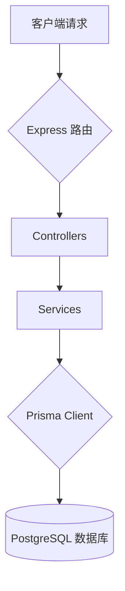

# 技术设计: 数据库集成

## 1. 架构概述
我们将采用 Prisma 作为 ORM (对象关系映射) 工具，将现有的 Node.js/Express 后端服务与 PostgreSQL 数据库连接起来。这将使我们的应用架构演变为一个更健壮的模式：`Controllers -> Services -> Prisma Client -> PostgreSQL`。

通过引入 Prisma，我们可以获得端到端的类型安全，从数据库模式到应用层代码，从而减少运行时错误并提高开发效率。

### Mermaid 图表


## 2. 数据模型/接口设计

### 数据库
我们将定义一个核心的 `Feedback` 数据模型。该模型将在 `prisma/schema.prisma` 文件中定义，这是 Prisma 管理数据库模式的唯一真实来源。

**`Feedback` 模型:**
```prisma
model Feedback {
  id        String   @id @default(uuid()) @db.Uuid
  type      String
  content   String
  contact   String?
  createdAt DateTime @default(now())
  updatedAt DateTime @updatedAt
}
```

### API 端点
为了与新的数据模型交互，我们将对现有的 `/api/feedback` 端点进行增强和重构。

*   **`POST /api/feedback`**
    *   **描述:** 创建一条新的用户反馈。
    *   **请求体:** `{ "type": "suggestion", "content": "希望增加暗黑模式", "contact": "user@example.com" }`
    *   **成功响应 (201):** `{ "id": "...", "type": "...", "content": "...", ... }`

*   **`GET /api/feedback`**
    *   **描述:** 获取所有反馈记录列表。
    *   **成功响应 (200):** `[{...}, {...}]`

*   **`GET /api/feedback/:id`**
    *   **描述:** 根据 ID 获取单条反馈记录。
    *   **成功响应 (200):** `{...}`

## 3. 关键组件与测试策略

### 关键组件
1.  **Prisma Client:** 在 `src/lib/prisma.ts` 中初始化一个单例的 Prisma Client，以确保整个应用共享同一个数据库连接池。
2.  **`feedbackService.ts` 重构:** 更新服务层以使用 Prisma Client 替代内存数组，执行数据库的 CRUD (创建、读取、更新、删除) 操作。
3.  **环境变量:** 在 `.env` 文件中配置 `DATABASE_URL`，用于安全地管理数据库连接字符串。
4.  **Prisma Migrations:** 使用 `prisma migrate` 命令来生成和应用 SQL 迁移文件，确保数据库模式与 `schema.prisma` 同步。

### 测试策略
*   **单元测试:** 使用 `jest-mock-extended` 来深度模拟 `PrismaClient`。这将允许我们在不实际连接数据库的情况下，独立测试 `feedbackService.ts` 中的业务逻辑。
*   **集成测试:** 针对 API 端点 (`/api/feedback`) 编写集成测试。这些测试将连接到一个独立的测试数据库，以验证从控制器到数据库的整个流程是否按预期工作。